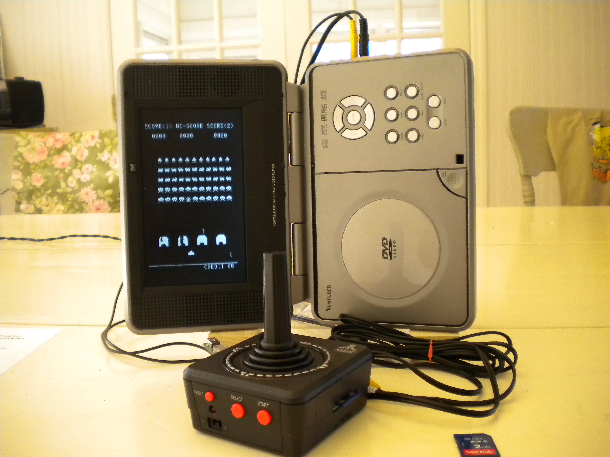

# SpaceInvadersJoystick
The Space Invaders Joystick

### As Seen In Circuit Cellar Magazine
 
https://cc-webshop.com/collections/circuit-cellar-2012/products/circuit-cellar-issue-260-march-2012-pdf

### As seen on Youtube
  
http://www.youtube.com/watch?v=n8_lrEy30JE

The SID COG:
http://forums.parallax.com/showthread.php?118285-SIDcog-The-sound-of-the-Commodore-64-!

The early Z80 emulation work:
http://forums.parallaxinc.com/forums/pr.aspx?f=25&m=332138

# Completed System

The portable DVD TV is turned sideways to match the rotation of the arcade system.

# Replacement Board

There are 5 switch pads. One is shown mounted. The yellow casing acts like a spring for a conductive disk inside.

# Schematic and PCB

# Software

